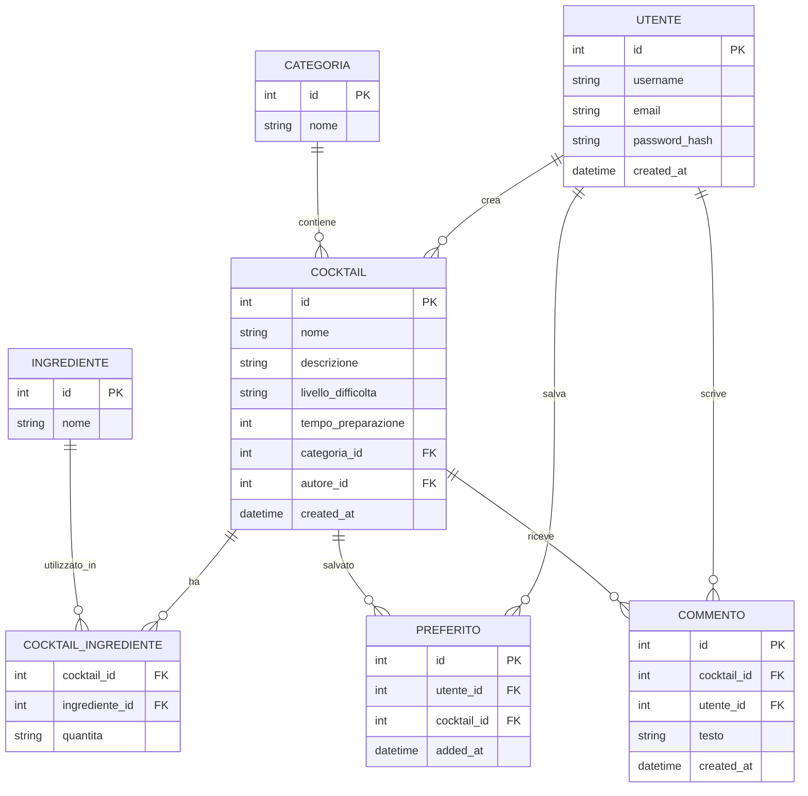
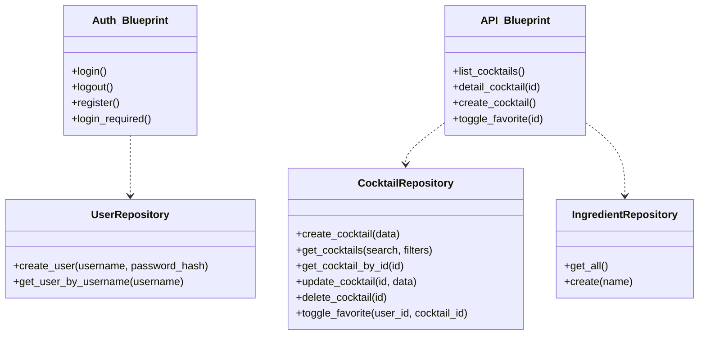

# Documentazione Tecnica — CocktailHub Backend

---

## 1. Introduzione

Il progetto è un backend per la gestione di un ricettario di cocktail (CocktailHub) sviluppato con Python e Flask. Espone un'API REST per:
- consultare, creare, modificare e cancellare cocktail;
- gestire ingredienti e categorie;
- salvare cocktail come preferiti dagli utenti autenticati.

Il backend è pensato per essere consumato da un frontend separato (es. sito statico o SPA) e per essere eseguibile localmente o distribuito su un hosting Python compatibile.

---

## 2. Obiettivi generali

- Permettere a chiunque di consultare l'elenco di cocktail e i dettagli (senza autenticazione).
- Consentire agli utenti registrati di creare, modificare e cancellare i propri cocktail.
- Permettere agli utenti autenticati di salvare cocktail tra i preferiti.
- Fornire ricerca e filtri per categoria, ingredienti, difficoltà o tempo di preparazione.
- Organizzare il codice con Blueprints e Repository Pattern per testabilità e manutenzione.

---

## 3. Requisiti funzionali

### Funzionalità principali

1. Visualizzazione elenco cocktail (`GET /api/cocktails`) con filtri e paginazione.
2. Visualizzazione dettaglio cocktail (`GET /api/cocktails/<id>`).
3. Creazione di un cocktail (`POST /api/cocktails`) — autenticazione richiesta.
4. Modifica ed eliminazione di cocktail dell'autore (`PUT/DELETE /api/cocktails/<id>`) — autenticazione richiesta.
5. Gestione ingredienti e associazione cocktail-ingredienti con quantità (`POST /api/ingredients`, relazione many-to-many).
6. Salvataggio/rieliminazione preferiti (`POST /api/cocktails/<id>/toggle-favorite`) — autenticazione richiesta.
7. Registrazione e login dell'utente (sessioni o token).

### User stories (esempi)

- Come visitatore, voglio vedere l'elenco dei cocktail e i dettagli per provarli.
- Come utente autenticato, voglio creare e gestire i miei cocktail.
- Come utente, voglio filtrare i cocktail per categoria o ingrediente.
- Come utente, voglio salvare i cocktail preferiti per ritrovarli facilmente.

---

## 4. Requisiti non funzionali

- Password memorizzate con hashing sicuro (es. Werkzeug `generate_password_hash`).
- CORS abilitato per permettere richieste dal frontend esterno.
- Utilizzo di database relazionale leggero (SQLite per sviluppo).
- Struttura modulare con Blueprints (`auth`, `api`) e repository per accesso ai dati.
- Configurazione tramite `.env` per variabili sensibili (SECRET_KEY, DB path, eventuali API key).
- Possibilità di eseguire il progetto con ambiente virtuale Python (`venv`).

---

## 5. Schema ER (Entità e Relazioni)

> Nota: COCKTAIL_INGREDIENTE è un'entità associativa con l'attributo quantita.

---

## 6. Diagramma UML delle classi (semplificato)

---

## 7. Glossario

- Cocktail: ricetta composta da nome, ingredienti (con quantità), procedimento e metadati.
- Categoria: raggruppamento tematico (es. Sour, Tiki, Long Drink).
- Ingrediente: voce riutilizzabile (es. Rum, Succo di Lime).
- Preferito: associazione utente-cocktail che indica salvataggio.
- Autore: utente che ha creato un cocktail.

---

## 8. Pianificazione del progetto (sintesi)

- Setup ambiente e DB: 2-3 giorni
- Modello dati e repository: 3-4 giorni
- Blueprints auth e api: 4-5 giorni
- Filtri, ricerca e preferiti: 2-3 giorni
- Test e documentazione: 2-3 giorni
- Deployment/test remoto: 1-2 giorni

---

## 9. Diagramma dei casi d'uso (sintesi)

Attori: Visitatore, Utente autenticato (Autore).

Principali casi d'uso:
- Consultare lista cocktail (pubblico)
- Consultare dettaglio cocktail (pubblico)
- Creare/modificare/eliminare cocktail (utente autenticato)
- Salvare cocktail tra i preferiti (utente autenticato)
- Filtrare e cercare cocktail (pubblico/utente)

