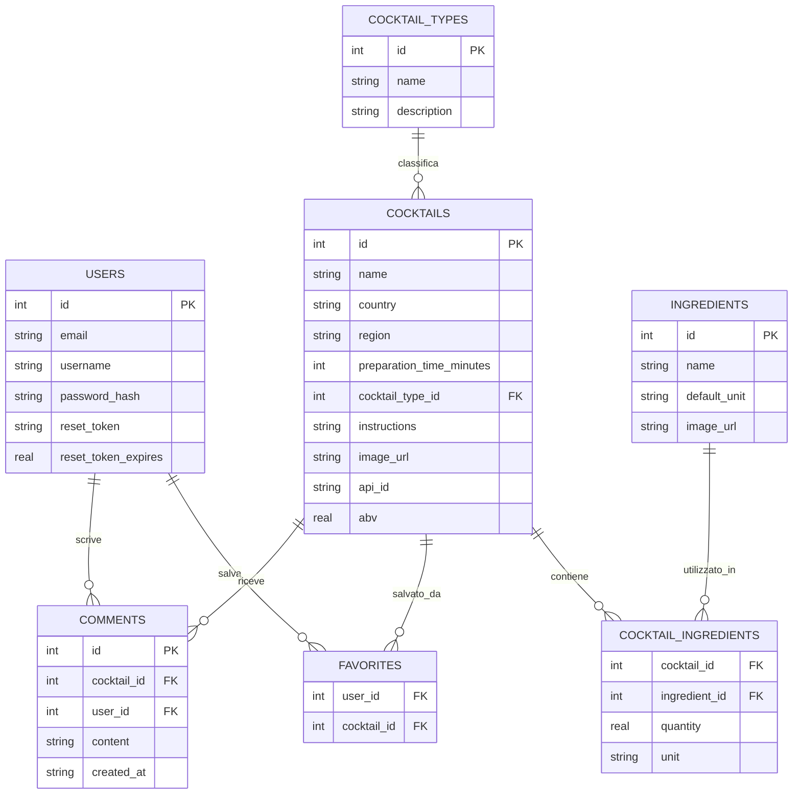
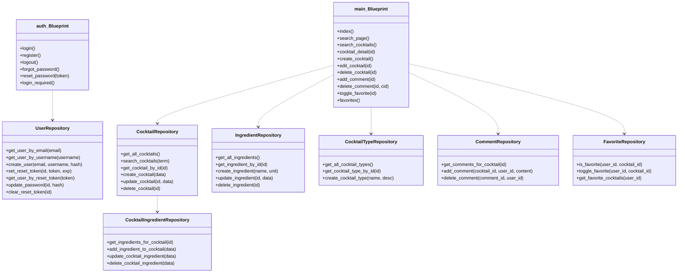

# Documentazione Tecnica — CocktailHub Backend

---

## 1. Introduzione

Il progetto è un'applicazione web per la gestione di un ricettario di cocktail (CocktailHub) sviluppata con Python e Flask. Permette di:
- consultare, creare, modificare e cancellare cocktail;
- gestire ingredienti e categorie (tipi di cocktail);
- cercare cocktail per nome o ingrediente;
- salvare cocktail tra i preferiti;
- lasciare commenti sui cocktail;
- registrarsi, accedere e recuperare la password via email.

L'interfaccia è basata su template HTML Jinja2 con CSS personalizzato. Il backend utilizza SQLite come database e segue il Repository Pattern, organizzato in due Blueprint Flask (`main` e `auth`).

---

## 2. Obiettivi generali

- Permettere a chiunque di consultare l'elenco dei cocktail e cercarli (senza autenticazione).
- Consentire agli utenti registrati di vedere i dettagli, creare, modificare e cancellare cocktail.
- Permettere agli utenti autenticati di salvare preferiti e lasciare commenti.
- Organizzare il codice con Blueprint e Repository Pattern per testabilità e manutenzione.

---

## 3. Funzionalità implementate

### Route — Blueprint `main`

| Metodo | URL | Autenticazione | Descrizione |
|--------|-----|:-:|-------------|
| GET | `/` | No | Home: lista cocktail con ricerca |
| GET | `/search?q=<testo>` | No | Ricerca per nome o ingrediente |
| GET | `/cocktails` | No | Elenco completo cocktail |
| GET | `/cocktails/<id>` | Sì | Dettaglio cocktail con commenti e preferito |
| GET/POST | `/cocktails/create` | Sì | Crea nuovo cocktail |
| GET/POST | `/cocktails/<id>/edit` | Sì | Modifica cocktail |
| POST | `/cocktails/<id>/delete` | Sì | Elimina cocktail |
| POST | `/cocktails/<id>/comment` | Sì | Aggiunge un commento |
| POST | `/cocktails/<id>/comment/<cid>/delete` | Sì | Elimina un commento |
| POST | `/cocktails/<id>/favorite` | Sì | Aggiunge/rimuove dai preferiti |
| GET | `/preferiti` | Sì | Lista cocktail preferiti dell'utente |

### Route — Blueprint `auth`

| Metodo | URL | Descrizione |
|--------|-----|-------------|
| GET/POST | `/auth/login` | Login con email e password |
| GET/POST | `/auth/register` | Registrazione nuovo utente |
| GET | `/auth/logout` | Logout |
| GET/POST | `/auth/forgot-password` | Richiesta reset password via email |
| GET/POST | `/auth/reset-password/<token>` | Reset password con token |

### User stories

- Come visitatore, voglio vedere l'elenco dei cocktail e cercarli per nome o ingrediente.
- Come utente autenticato, voglio vedere i dettagli di un cocktail, i suoi ingredienti e i commenti.
- Come utente autenticato, voglio creare, modificare ed eliminare i miei cocktail.
- Come utente, voglio salvare i cocktail preferiti per ritrovarli facilmente.
- Come utente, voglio lasciare commenti sui cocktail.

---

## 4. Requisiti non funzionali

- Password memorizzate con hashing sicuro (Werkzeug `generate_password_hash`).
- Utilizzo di database relazionale leggero (SQLite).
- Struttura modulare con Blueprint (`main`, `auth`) e repository separati per accesso ai dati.
- Ambiente virtuale Python (`venv`) per isolare le dipendenze.
- Reset password via email con token a scadenza (1 ora), configurabile tramite variabili SMTP.

---

## 5. Schema ER (Entità e Relazioni)

> Nota: COCKTAIL_INGREDIENTS è un'entità associativa many-to-many tra COCKTAILS e INGREDIENTS, con quantity e unit specifiche per ogni ricetta.

---

## 6. Diagramma UML delle classi (semplificato)

---

## 7. Glossario

- **Cocktail**: ricetta con nome, ingredienti (quantità e unità), istruzioni e metadati (paese, regione, ABV, tempo).
- **Tipo cocktail** (`cocktail_types`): raggruppamento tematico (es. Classico, Tropicale, Senza alcool).
- **Ingrediente**: voce riutilizzabile (es. Vodka, Succo di limone) con unità di misura predefinita.
- **Preferito**: associazione utente-cocktail che permette di ritrovare rapidamente i cocktail salvati.
- **Commento**: testo scritto da un utente autenticato su un cocktail specifico.

---

## 8. Pianificazione del progetto (sintesi)

- Setup ambiente e DB: 2-3 giorni
- Modello dati e repository: 3-4 giorni
- Blueprint `main` e route pubbliche: 2-3 giorni
- Blueprint `auth` (login, registrazione, reset password): 3-4 giorni
- Preferiti e commenti: 2-3 giorni
- Template HTML e CSS: 2-3 giorni
- Test e documentazione: 2-3 giorni

---

## 9. Casi d'uso (sintesi)

**Attori:** Visitatore, Utente autenticato.

Principali casi d'uso:
- Consultare la lista dei cocktail e cercarli per nome o ingrediente (pubblico)
- Consultare il dettaglio di un cocktail con ingredienti e commenti (utente autenticato)
- Creare, modificare ed eliminare cocktail (utente autenticato)
- Salvare/rimuovere un cocktail dai preferiti (utente autenticato)
- Lasciare ed eliminare commenti (utente autenticato)
- Registrarsi, fare login e recuperare la password (pubblico)
