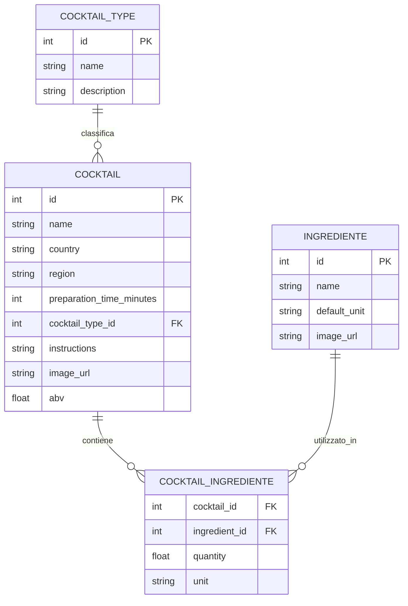
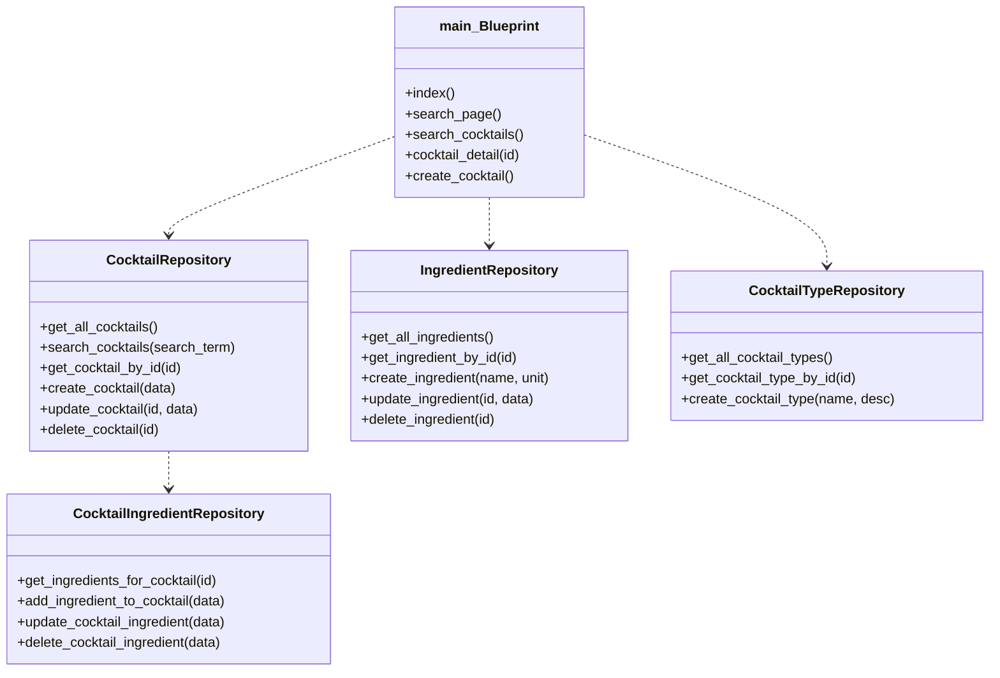

# Documentazione Tecnica — CocktailHub Backend

---

## 1. Introduzione

Il progetto è un'applicazione web per la gestione di un ricettario di cocktail (CocktailHub) sviluppata con Python e Flask. Permette di:
- consultare, creare, modificare e cancellare cocktail;
- gestire ingredienti e categorie (tipi di cocktail);
- cercare cocktail per nome o ingrediente.

L'interfaccia è basata su template HTML Jinja2 con CSS personalizzato. Il backend utilizza SQLite come database e segue il Repository Pattern per l'accesso ai dati, organizzato in un singolo Blueprint Flask (`main`).

---

## 2. Obiettivi generali

- Permettere a chiunque di consultare l'elenco di cocktail e i dettagli (nessuna autenticazione richiesta).
- Consentire la creazione di nuovi cocktail con ingredienti e quantità.
- Permettere la ricerca di cocktail per nome o ingrediente.
- Organizzare il codice con Blueprint e Repository Pattern per testabilità e manutenzione.

---

## 3. Funzionalità implementate

### Route disponibili

| Metodo | URL | Descrizione |
|--------|-----|-------------|
| GET | `/` | Home: lista cocktail con ricerca integrata |
| GET | `/search?q=<testo>` | Ricerca cocktail per nome o ingrediente |
| GET | `/cocktails` | Elenco completo di tutti i cocktail |
| GET | `/cocktails/<id>` | Dettaglio singolo cocktail con ingredienti |
| GET/POST | `/cocktails/create` | Form per creare un nuovo cocktail |

### User stories

- Come visitatore, voglio vedere l'elenco dei cocktail e i dettagli per provarli.
- Come utente, voglio cercare cocktail per nome o ingrediente.
- Come utente, voglio creare un nuovo cocktail specificando ingredienti e quantità.

---

## 4. Requisiti non funzionali

- Utilizzo di database relazionale leggero (SQLite).
- Struttura modulare con Blueprint (`main`) e repository separati per accesso ai dati.
- Ambiente virtuale Python (`venv`) per isolare le dipendenze.
- Configurazione tramite `app/__init__.py` (SECRET_KEY e percorso DB).

---

## 5. Schema ER (Entità e Relazioni)

> Nota: COCKTAIL_INGREDIENTE è un'entità associativa (many-to-many) tra COCKTAIL e INGREDIENTE, con gli attributi quantity e unit.

---

## 6. Diagramma UML delle classi (semplificato)

---

## 7. Glossario

- **Cocktail**: ricetta composta da nome, ingredienti (con quantità e unità), istruzioni e metadati (paese, regione, ABV, tempo di preparazione).
- **Tipo cocktail** (`cocktail_type`): raggruppamento tematico (es. Sour, Tiki, Long Drink).
- **Ingrediente**: voce riutilizzabile (es. Rum, Succo di Lime) con unità di misura predefinita.
- **Associazione cocktail-ingrediente**: relazione many-to-many con quantità e unità specifiche per ogni cocktail.

---

## 8. Pianificazione del progetto (sintesi)

- Setup ambiente e DB: 2-3 giorni
- Modello dati e repository: 3-4 giorni
- Blueprint `main` e route: 4-5 giorni
- Ricerca e filtri: 2-3 giorni
- Template HTML e CSS: 2-3 giorni
- Test e documentazione: 2-3 giorni

---

## 9. Casi d'uso (sintesi)

**Attore unico:** Utente (nessuna distinzione di ruoli nella versione attuale).

Principali casi d'uso:
- Consultare la lista dei cocktail (home)
- Consultare il dettaglio di un cocktail con i suoi ingredienti
- Cercare cocktail per nome o ingrediente
- Creare un nuovo cocktail con ingredienti multipli
